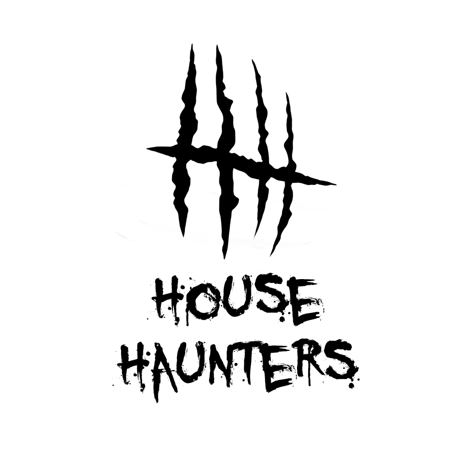

I did not make this from scratch: I started with a college friend's game and went with it:
https://github.com/adamflentz/Game-Design-Group-7

A lot of it has changed, but I really like their game loop and wanted to make it better and add to it.

# House Haunters



Hunt or be Haunted: a four-player top-down haunted-house romp built in C++14 and
[SFML](https://www.sfml-dev.org/). Up to four players (gamepad or keyboard) explore a procedurally
laid-out mansion, picking up clues and trying to figure out which item will banish
the ghost before it gets all of them. The ghost player is the engine.

---

## Quick start

### Downloading a build

Executables are native to an operating system; a Windows `.exe` cannot run on
macOS or Linux. The **Cross-platform release** GitHub Actions workflow produces
separate ready-to-share downloads:

| Recipient | Download | How to run |
|---|---|---|
| Windows x64 | `HouseHaunters-Windows-x64` | Double-click `HH.exe` |
| macOS Intel | `HouseHaunters-macOS-x64` | Unzip and open `HH.app` |
| macOS Apple Silicon | `HouseHaunters-macOS-arm64` | Unzip and open `HH.app` |
| Linux x64 | `HouseHaunters-Linux-x64` | Mark the AppImage executable and open it |

Run the workflow manually from the repository's **Actions** tab, or push a tag
whose name starts with `v`. All assets are embedded; recipients do not need the
repository, SFML, Python, or a separate `resources/` directory. The macOS build
is ad-hoc signed rather than Apple-notarized, so the first launch may require
Control-clicking the app and choosing **Open**.

### Building on Windows

Prerequisites:
* **Visual Studio 2022 Community** with the Desktop C++ workload (provides MSVC 14.4x and `vcvars64.bat`).
* **CMake 3.16+** and **Ninja** on `PATH`.
* No SFML install required — a pinned copy of SFML 2.6.2 lives in [vendor/sfml-extract/](vendor/sfml-extract/).

Build (debug + test suite) and play:

```powershell
# One-time CMake configure of the test build dir, plus build everything,
# plus auto-run the CTest suite:
.\_build_tests.bat

# Build the optimized release binary:
.\_build_release.bat

# Run the release build (resources are resolved relative to the .exe):
cd build-release
.\HH.exe
```

`_build_tests.bat` and `_build_release.bat` are thin wrappers around `vcvars64.bat`
plus `cmake --build`; see the [Manual build](#manual-build) section if you want to
drive CMake yourself.

> The release binary lives at `build-release\HH.exe`. It must be launched from
> its build directory (or any working directory one level below a `resources/`
> folder) because asset paths are resolved as `../resources/...` — see
> [include/engine/Paths.hpp](include/engine/Paths.hpp).

#### Building a Windows redistributable for friends

For sharing the game with someone who doesn't have the SFML DLLs (or this
repo at all), use the *standalone* build. It statically links SFML and bakes
the entire `resources/` directory into `HH.exe` itself via a Win32 .rc
resource script, so the redistributable is **literally one file**: `HH.exe`.

```powershell
# Builds the single-file HH.exe into build-standalone\ AND copies it to
# dist\HH.exe:
.\_package_standalone.ps1
```

Then send `dist\HH.exe` (≈55 MB) directly — recipient double-clicks and plays.

### Building on macOS or Linux

Prerequisites are CMake 3.16+, a C++14 compiler, Git, Python 3, and platform
development packages. SFML itself is fetched at its pinned `2.6.2` tag and
built statically. On macOS, install the Xcode command-line tools. On
Debian/Ubuntu Linux, install the X11, XRandR, XCursor, udev, FreeType, and
OpenGL development packages used by SFML.

```bash
chmod +x _build_standalone.sh
./_build_standalone.sh
```

On macOS this creates a zipped, ad-hoc-signed `.app` under `dist/`. On Linux it
creates a native compressed binary; the automated release workflow additionally
wraps that binary and its system libraries as an AppImage for broader distro
compatibility.

Audio is provided by the vendored [miniaudio](vendor/miniaudio/) single-header
library compiled into `HH.exe`, so there is no `openal32.dll` to ship either.
The only runtime requirement is the Microsoft Visual C++ 2015–2022 x64
Redistributable, which most Windows installs already have
(<https://aka.ms/vs/17/release/vc_redist.x64.exe> otherwise).

#### How the resource bundling works

| Piece | Lives in |
|---|---|
| Generator script | [tools/generate_embedded_resources.py](tools/generate_embedded_resources.py) |
| CMake glue | `HH_EMBED_RESOURCES` option in [CMakeLists.txt](CMakeLists.txt) |
| Runtime dispatcher | [include/engine/ResourceFS.hpp](include/engine/ResourceFS.hpp), [src/engine/ResourceFS.cpp](src/engine/ResourceFS.cpp) |
| Win32 RT_RCDATA backend | [src/engine/EmbeddedResources_Win32.cpp](src/engine/EmbeddedResources_Win32.cpp) |

In a normal dev build (`_build_tests.bat` / `_build_release.bat`),
`HH_EMBED_RESOURCES` defaults to OFF and `ResourceFS` reads bytes from
`../resources/` on disk — exactly as before. In the standalone build it
defaults to ON, the generator emits a `.rc` script + a path→ID table, MSVC
links them into `HH.exe`'s `.rsrc` section, and `ResourceFS` serves bytes
via `FindResource` + `LockResource` (zero-copy pointer into the mapped
image). All call sites are the same in both modes — they call
`Paths::resource("sound/foo.wav")` and the right backend takes over.

---

## Manual build (any platform)

The project is a vanilla CMake build with a single executable target (`HH`) and
a single static library (`HouseHaunters_core`) that the test suite reuses.

```bash
# Configure (out-of-source build is recommended)
cmake -S . -B build -G Ninja -DCMAKE_BUILD_TYPE=Release

# Build the game + the entire test suite
cmake --build build

# Run the test suite (CTest is also re-run automatically on every
# build of the default target -- see tests/CMakeLists.txt for the
# HH_RUN_TESTS_ON_BUILD switch).
ctest --test-dir build --output-on-failure
```

Useful CMake options:

| Option | Default | Effect |
|---|---|---|
| `-DCMAKE_BUILD_TYPE=...` | `Debug` (in-source) / inferred from build dir name (out-of-source) | `Debug`, `Release`, or `Profile` |
| `-DBUILD_TESTING=OFF` | `ON` | Skip the test suite entirely |
| `-DHH_RUN_TESTS_ON_BUILD=OFF` | `ON` | Build tests but don't re-run them every build |
| `-DHH_STATIC_SFML=ON` | `OFF` | Link SFML statically and default resource embedding to ON |
| `-DHH_EMBED_RESOURCES=ON` | follows `HH_STATIC_SFML` | Embed assets in the native executable |
| `-DHH_FETCH_SFML=...` | `OFF` on Windows, `ON` elsewhere | Build pinned SFML 2.6.2 source instead of requiring a platform package |
| `-DSFML_ROOT=/path/to/SFML` | (uses vendored/fetched SFML 2.6.2) | Override dependency discovery when fetching is disabled |

The whole project compiles with `/W4 /permissive-` on MSVC and `-Wall -Wextra
-Wpedantic` on GCC/Clang; warnings are treated as bugs, not suppressed.

---

## Playing the game

### Characters

| Character | Stats | Ability |
|---|---|---|
| **The Brother** (`BRO`) | 3 HP, base speed | Sprint toggle (`X` / `Square`) |
| **The Sister** (`SIS`) | 3 HP, base speed | Invisible to the ghost while standing still |
| **The Father** (`DAD`) | **5 HP**, base speed | Extra damage when using a jackpot item |
| **The Mother** (`MOM`) | 3 HP, 0.85× speed | Can upgrade a "worthless" clue into a real one |

Each player picks a unique character on the lobby screen; up to four players can
join and the host can force-start with fewer (including solo).

### The loop

1. **Lobby** — LOCAL PLAY opens with a "press any button to begin" gate so a
   host can plug in extra controllers first. The first button release on any
   gamepad (or any key on the keyboard) claims P1 and drops the gate. After
   that, any new controller plugged in is auto-detected and slotted in as
   P2/P3/P4 with no extra button press needed. Use LEFT/RIGHT to hover the
   four character portraits, the `A` button to lock in (each character can
   only be picked once), and `MENU` / `Escape` to back out to the title.
2. **Hunt** — explore the house. Tiles have clues scattered through them. Each
   clue is one of four tiers: `worthless`, `vague`, `specific`, or `jackpot`.
   Combine clues to figure out which item kills the ghost.
3. **Confront** — pick up the right item to do real damage. The wrong item still
   stings the ghost a bit but won't kill it.
4. **Survive** — if a character is killed they enter spectator mode and can watch
   any teammate (LEFT/RIGHT to switch targets). The game ends with a `GAME OVER`
   screen only when every player is down. The villain gravitates toward the
   closest still-visible player, so splitting up and keeping the Sister
   stationary (her built-in stealth) remain core survival tactics.

### The ghost AI (Alien: Isolation-style)

The villain is driven by a two-tier AI inspired by *Alien: Isolation*:

* **The Director** (`VillainDirector`, the all-knowing half) has perfect
  information about every player's position at every instant. It never moves
  anyone -- it only answers "who is closest to *this* point?" when asked.
* **The Hunter** (`Villain`, the unknowing half) deliberately knows nothing
  about player positions on its own. Once per *ping interval* it asks the
  Director, caches the answer as a single wander hint, and walks toward it.
  Between pings the ghost is genuinely operating on stale information.

Difficulty controls how often the Hunter pings:

| Difficulty | Ping interval | Feel |
|---|---|---|
| Easy   | 8.0 s | Pings rarely. Half the time the ghost is wandering on minutes-old info. |
| Normal | 4.0 s | Default. Re-targets often enough to feel intentional, rarely enough to lose. |
| Hard   | 1.5 s | Re-targets almost every couple of seconds; the ghost almost always knows. |

If a player steps into the room the ghost is currently in, the Hunter latches
onto **that specific player** and keeps chasing them -- pings or no pings --
until they leave the room (or die, or become invul, or the Sister stops moving
and turns invisible). A second player entering the same room cannot steal the
chase from the first.

The ghost begins slower than the slowest player character, leaving room for a
clean escape. After 90 and 180 seconds of haunting, its pressure level rises:
Director pings become more frequent and chase speed increases, so endless
kiting eventually stops being safe. The
[test_villain_ai.cpp](tests/test_villain_ai.cpp) suite pins this invariant
along with the difficulty-scaled ping cadence.

### Endgame powers

Four passives only activate when the team has taken losses, to keep the game
winnable in the late hunt:

* **The Sister — *Final Girl*.** When SIS is the last living family member her
  standing-still stealth lapses (the ghost would otherwise wander forever with
  no target) but her movement speed gets a permanent **×1.5** boost. The boost
  is large enough that she still outruns the ghost's chase speed, so the kite
  loop survives even when she's alone.
* **The Mother — *Maternal Fury*.** The first time one of her children (BRO or
  SIS) dies, MOM gains a permanent **+2** strength bonus that adds to every
  villain hit she lands. Stacks on top of whatever weapon she's holding,
  including the jackpot weapon. Triggers once and stays.
* **The Brother — *Man of the House*.** When DAD dies, BRO inherits the
  protector role and gains a permanent **+3** strength bonus on every villain
  hit. Composes with his existing sprint and any jackpot weapon.
* **The Father — *It Just Keeps Taking and Taking* + *Papa Bear*.** When MOM
  (his wife) dies, DAD's maxHealth **doubles** and he's healed to the new cap
  -- the ghost has to wail on him twice as long to put him down. Separately,
  every time one of his children dies he gains another **+1** strength bonus
  (the *Papa Bear* effect) -- exactly **half** of MOM's per-event bonus, since
  she cares whether ANY child has died while DAD grieves progressively. If he
  loses both children the stack reaches **+2**, matching MOM's one-shot fury.
  The two powers are independent and both stack with weapons.

All four powers are pinned by [test_villain_ai.cpp](tests/test_villain_ai.cpp).

### Controls

Up to 4 controllers are supported (gamepads and keyboard mix freely). Controller
layouts are auto-detected by USB VID/PID, so DualShock 3 / DualShock 4 /
DualSense, Xbox 360 / Xbox One / Xbox Series, Steam Controller, Switch Pro,
8BitDo, and most third-party Xbox-style pads work out of the box. Unknown
controllers fall back to the generic SDL XInput mapping. New controllers
plugged in mid-lobby are detected automatically.

| Action | Keyboard | PlayStation | Xbox / generic |
|---|---|---|---|
| Move | Arrow keys | D-pad / left stick | D-pad / left stick |
| Interact / read clue | `Z` | `X` (Cross) | `A` |
| Attack | `X` | `Circle` | `B` |
| Sprint (Brother only) | `C` | `Square` | `X` |
| Cycle weapon | `V` | `Triangle` | `Y` |
| Menu / back | `Esc` | `Options` / `Start` | `Start` |

In spectator mode (after your character dies), LEFT/RIGHT cycle through
surviving teammates.

### Optional CLI flags

```text
HH.exe [--fullscreen|-f] [--windowed|-w] [--help|-h]
```

Both flags are mirrored by environment variables (`HH_FULLSCREEN=1`,
`HH_TEST_BYPASS=1`); see [bin/HH.cpp](bin/HH.cpp) for the full list.

---

## Networked multiplayer (optional)

Set `HH_NET` before launching to opt into the lockstep TCP backbone:

```powershell
# On the host machine (here, expecting 1 client to join on port 53353):
$env:HH_NET = "host:1:53353"; .\HH.exe

# On the client:
$env:HH_NET = "client:192.168.1.42:53353"; .\HH.exe
```

If `HH_NET` is unset the game runs in offline couch-co-op mode, and the
NetworkManager calls are no-ops. The full protocol is documented at the top of
[include/engine/NetworkManager.hpp](include/engine/NetworkManager.hpp).

---

## Modding

The lobby, every playable character's stats and sprites, the villain's
sprites, and every music loop / sound effect are all data-driven from
[resources/mods.xml](resources/mods.xml). Edit that file, save, and
re-launch — no rebuild needed. A missing or malformed file silently falls
back to the vanilla defaults baked into the binary.

See [MODDING.md](MODDING.md) for the full reference and a couple of
ready-to-paste examples (including how to rebind any of the seven in-game
audio cues to your own `.ogg` / `.flac` / `.wav` files).

---

## Repository layout

The repo follows the conventional "headers in `include/`, implementations in
`src/`" split. Each folder has its own `README.md` going into more detail; the
links below point at the entry-point for each layer.

| Folder | Purpose |
|---|---|
| [bin/](bin/README.md) | `main()` and the CLI flag parser |
| [cmake/](cmake/README.md) | `FindSFML.cmake` and other CMake helpers |
| [include/](include/README.md) | Public headers (mirrors `src/`) |
| [include/components/](include/components/README.md) | Generic game-object building blocks (Hitbox, EntityGroup, SpriteAnimation) |
| [include/engine/](include/engine/README.md) | Engine internals: event bus, screen stack, resource cache, input, networking, mod loader |
| [include/game/](include/game/README.md) | Game-specific code: characters, rooms, screens, objects, `Config` |
| [include/rapidxml/](include/rapidxml/README.md) | Vendored single-header XML parser |
| [src/](src/README.md) | Implementations (mirrors `include/`) |
| [resources/](resources/README.md) | All shipped assets: PNG, TTF, FLAC/WAV/OGG, TMX, XML, JSON |
| [tests/](tests/README.md) | CTest-driven regression suite (one executable per `test_*.cpp`) |
| [tools/](tools/README.md) | Python helpers (sprite-atlas builder, asset audit scripts) |
| [vendor/](vendor/README.md) | Pinned third-party dependencies (SFML, embedded Python) |

The top-level `build*/` directories are generated by CMake and are safe to
delete at any time. `dist/` is a placeholder for packaged release builds.

---

## Testing

Every `tests/test_*.cpp` becomes its own CTest executable that links against
`HouseHaunters_core` (the same code the game ships). CTest runs as part of every
default build (`cmake --build .`) unless you pass `-DHH_RUN_TESTS_ON_BUILD=OFF`.

```powershell
# Build + auto-run tests
.\_build_tests.bat

# Just run them again without rebuilding
.\_run_tests.bat
```

The current suite covers: clue/XML loader, screen flow, character and villain
init, paths, events, gamepad routing, networking handshake and tick exchange,
join codes, mod-config XML, and spectator targeting. See
[tests/README.md](tests/README.md) for a per-file map.

---

## License

This is a personal fork of an academic project; see the original repo linked at
the top of this README. Vendored third-party code (SFML, RapidXML, embedded
Python) keeps its own license; consult each `vendor/` subdirectory.

